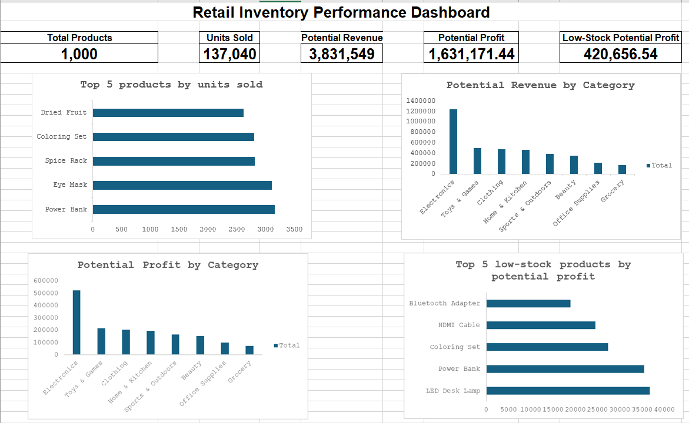
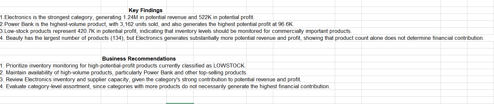

# Retail Inventory Performance & Stock Optimization Analysis

## Project Overview

This project analyzes retail inventory data using **Microsoft Excel** to understand sales performance, potential profitability, product assortment, supplier contribution, and inventory risk.

The analysis simulates a real-world business scenario where a junior data analyst supports retail inventory management by turning raw inventory data into actionable insights.

## Business Questions

The analysis answers the following questions:

1. Which products have the highest number of units sold?
2. Which product categories generate the highest potential revenue?
3. Which products generate the highest potential profit?
4. Which product categories are the most profitable?
5. Which products have the lowest closing stock?
6. Which LOWSTOCK products have the highest potential profit?
7. Which categories have the greatest number of products?
8. Which suppliers contribute the most products and potential profit?

## Tools & Techniques

* **Microsoft Excel**
* Data validation and quality checks
* Calculated columns
* Excel PivotTables
* Sorting and filtering
* KPI calculations
* Data visualization
* Dashboard design
* Business interpretation and recommendations

## Key Metrics

| Metric                    |    Result |
| ------------------------- | --------: |
| Total Products            |     1,000 |
| Units Sold                |   137,040 |
| Potential Revenue         | 3,831,549 |
| Potential Profit          | 1,631,171 |
| LOWSTOCK Potential Profit |   420,657 |

## Key Findings

* **Electronics** generated the highest potential revenue at approximately **1.24M** and the highest potential profit at approximately **522.1K**.
* **Power Bank** recorded the highest units sold at **3,162** and the highest potential profit at approximately **96.6K**.
* **Beauty** had the largest number of products with **134**, but Electronics generated substantially higher financial contribution, showing that product count alone does not determine category performance.
* Several LOWSTOCK products have significant potential profit, including **LED Desk Lamp**, **Power Bank**, **Coloring Set**, and **HDMI Cable**, making inventory monitoring important.
* Supplier contribution differed by measure: **Premier Merchandise** supplied the most products (**119**), while **Heritage Brands** recorded the highest potential profit contribution at approximately **194.4K**.

## Dashboard

The Excel dashboard summarizes the analysis using KPI cards and visualizations covering:

* Top products by units sold
* Potential revenue by category
* Potential profit by category
* LOWSTOCK products by potential profit
* Key findings
* Business recommendations

### Dashboard Preview





## Recommendations

Based on the analysis:

* Prioritize inventory monitoring for high-potential-profit products classified as LOWSTOCK.
* Maintain availability of high-volume products, particularly Power Bank.
* Review Electronics inventory levels and supplier capacity because of the category's strong financial contribution.
* Evaluate product assortment based on financial contribution rather than product count alone.
* Monitor suppliers using both product volume and potential profitability.

## Limitations

* Potential revenue and potential profit are calculated estimates based on units sold, retail price, and unit cost; they are not actual reported financial results.
* The dataset does not include operating expenses, discounts, returns, taxes, or other costs that could affect actual profitability.
* Supplier lead times, minimum order quantities, and historical replenishment information were not available.
* The analysis is based only on the information provided in the dataset.

## Project Files

```text
retail-inventory-analysis/
├── README.md
├── data/
│   └── retail_inventory_raw.xlsx
├── excel/
│   └── retail_inventory_analysis.xlsx
├── dashboard/
│   ├── retail_inventory_dashboard_1.png
│   └── retail_inventory_dashboard_2.png
└── documentation/
    └── Retail_Inventory_Analysis_Report.docx
```

## Conclusion

This project demonstrates how Excel can be used to transform raw retail inventory data into structured business insights. Through data validation, calculated metrics, PivotTable analysis, and dashboard visualization, the analysis identifies sales and profitability patterns while highlighting inventory areas that require closer monitoring.
